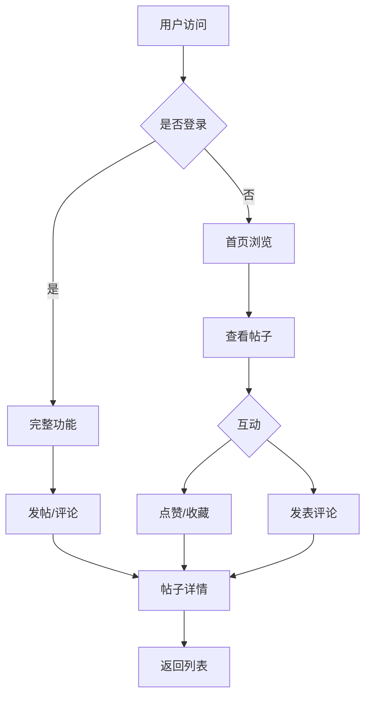

# AI 论坛产品需求文档

## 1. 产品概述

AI论坛是一个专注于人工智能领域的社区平台，旨在为AI爱好者、研究者和开发者提供一个高质量的技术交流空间。

**核心目标用户群体：**
- AI研究人员和学者
- 机器学习和深度学习工程师
- 对AI技术感兴趣的爱好者和初学者
- AI产品和创业 者

**核心价值：**
- 促进AI领域知识分享与交流
- 降低AI学习门槛，帮助新手快速成长
- 汇聚优质AI内容和资源

## 2. 核心功能

### 2.1 用户角色

| 角色 | 注册方式 | 核心权限 |
|------|----------|----------|
| 游客 | 无需注册 | 浏览公开内容 |
| 注册用户 | 邮箱注册/登录 | 发帖、评论、点赞、收藏、用户主页 |
| 管理员 | 系统分配 | 内容管理、用户管理、板块管理 |

### 2.2 功能模块

#### 首页模块
- **Hero区域**：展示论坛特色和价值主张
- **热门帖子列表**：按热度排序展示优质内容
- **最新帖子列表**：按时间排序展示最新内容
- **分类导航**：AI技术分类（机器学习、深度学习、NLP、计算机视觉等）

#### 帖子模块
- **发帖功能**：富文本编辑器，支持Markdown语法
- **帖子详情页**：标题、内容、作者信息、发布时间
- **评论系统**：层级评论，支持回复
- **互动功能**：点赞、收藏、分享

#### 用户模块
- **用户注册/登录**：邮箱验证码登录
- **个人主页**：用户信息、发帖记录、收藏列表
- **用户设置**：头像、昵称、个人简介修改

#### 分类模块
- 机器学习
- 深度学习
- 自然语言处理
- 计算机视觉
- AI工具与框架
- AI伦理与前沿
- 技术问答

### 2.3 页面详情

| 页面名称 | 模块名称 | 功能描述 |
|----------|----------|----------|
| 首页 | Hero区域 | 大标题、副标题、CTA按钮 |
| 首页 | 分类标签栏 | 横向滚动分类标签，点击筛选 |
| 首页 | 帖子列表 | 卡片式布局，包含标题、摘要、作者、点赞数 |
| 帖子详情页 | 帖子头部 | 标题、作者头像、发布时间、分类标签 |
| 帖子详情页 | 帖子内容 | Markdown渲染后的正文内容 |
| 帖子详情页 | 互动栏 | 点赞、收藏、分享按钮 |
| 帖子详情页 | 评论区域 | 评论列表、评论输入框 |
| 发帖页面 | 编辑器 | Markdown富文本编辑器 |
| 用户主页 | 用户信息卡 | 头像、昵称、简介、粉丝数、关注数 |
| 用户主页 | 内容标签页 | 我的帖子、我的收藏 |
| 登录/注册页 | 表单 | 邮箱输入、验证码、登录/注册按钮 |

## 3. 核心流程

### 3.1 用户浏览流程
```
用户进入首页 → 浏览热门/最新帖子 → 选择分类 → 查看帖子详情 → 参与互动/评论
```

### 3.2 用户发帖流程
```
登录 → 点击发帖 → 编辑标题和内容 → 选择分类 → 发布 → 跳转至帖子详情页
```

### 3.3 用户注册流程
```
进入登录页 → 点击注册 → 输入邮箱 → 获取验证码 → 设置密码 → 完成注册 → 自动登录
```

### 3.4 流程图（Mermaid）


## 4. 用户界面设计

### 4.1 设计风格

**设计理念：科技感与未来感**
- 采用深色主题为主，突出AI技术的神秘感和专业性
- 使用渐变色彩和微光效果营造科技氛围
- 简洁的卡片布局，清晰的信息层级

**色彩方案：**
- **主色**：#6366F1（靛蓝色，代表科技和创新）
- **次色**：#8B5CF6（紫色，代表智慧和创造力）
- **强调色**：#22D3EE（青色，代表未来和前沿）
- **背景色**：#0F172A（深蓝黑）
- **卡片背景**：#1E293B（深灰蓝）
- **文字主色**：#F8FAFC（近白色）
- **文字次色**：#94A3B8（灰蓝色）

**字体选择：**
- 标题：Source Han Sans CN（思源黑体）或 Noto Sans SC
- 正文：Inter
- 代码：JetBrains Mono

**按钮风格：**
- 圆角按钮，边框微微发光效果
- Hover时有光晕扩散动画
- 主要按钮使用渐变背景

**布局风格：**
- 左侧固定导航栏 + 右侧内容区域
- 卡片式内容布局
- 响应式：移动端底部导航栏

### 4.2 页面设计概览

#### 首页设计
| 模块 | 样式 | 布局 | 颜色 | 字体 | 动画 |
|------|------|------|------|------|------|
| Hero | 全宽背景渐变 | 居中内容 | 渐变背景 | 大号标题 | 粒子背景动画 |
| 导航栏 | 毛玻璃效果 | 固定顶部 | 半透明深色 | 常规 | 滚动时变色 |
| 分类标签 | 胶囊形状 | 横向滚动 | 边框样式 | 中号 | 选中时填充 |
| 帖子卡片 | 圆角卡片 | 网格布局 | 卡片背景 | 标题粗体 | Hover上浮 |

#### 帖子详情页设计
| 模块 | 样式 | 颜色 | 字体 |
|------|------|------|------|
| 标题区 | 大号标题 | 主色 | 粗体 |
| 作者信息 | 圆形头像+名称 | 文字主色 | 中号 |
| 内容区 | Markdown渲染 | 文字主色 | 常规 |
| 评论输入 | 深色输入框 | 边框发光 | 常规 |

#### 登录/注册页设计
| 模块 | 样式 | 布局 | 特效 |
|------|------|------|------|
| 表单容器 | 居中卡片 | 毛玻璃背景 | 边框发光 |
| 输入框 | 透明背景 | 边框渐变 | Focus发光 |
| 按钮 | 渐变背景 | 全宽 | Hover动效 |

### 4.3 响应式设计

- **桌面端（>1024px）**：左侧导航 + 主内容区
- **平板端（768-1024px）**：顶部导航 + 双列卡片
- **移动端（<768px）**：底部导航 + 单列卡片

### 4.4 视觉特效

- 背景：动态渐变网格背景或粒子动画
- 卡片：Hover时上浮 + 边框发光
- 按钮：渐变 + 微光效果
- 输入框：Focus时边框渐变发光
- 加载：骨架屏 + 脉冲动画

## 5. 质量标准

- 所有按钮和链接可点击
- 表单验证完整
- 加载状态友好提示
- 空状态设计合理
- 错误处理清晰
