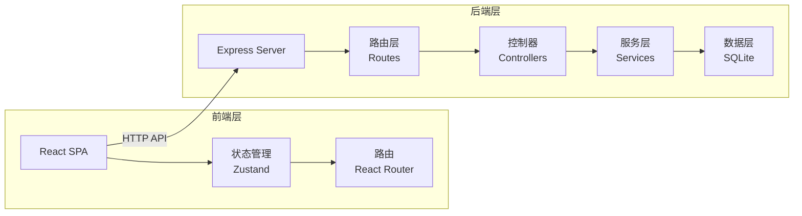
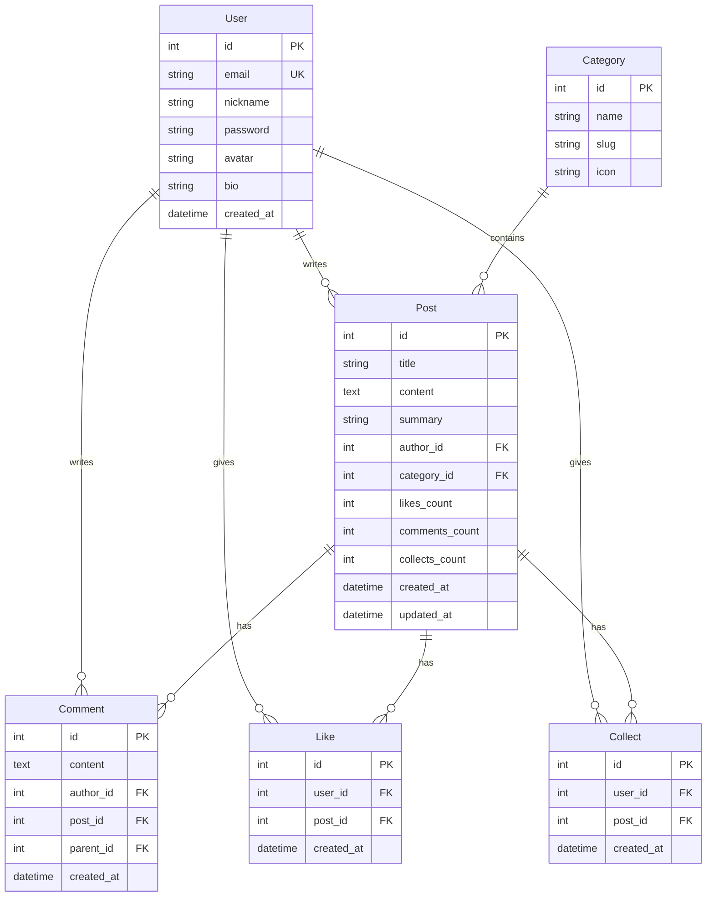

# AI 论坛技术架构文档

## 1. 架构设计

### 1.1 整体架构

本项目采用前后端分离架构，前端使用React构建单页应用，后端使用Node.js Express提供RESTful API服务。



### 1.2 技术栈

| 层级 | 技术选型 | 说明 |
|------|----------|------|
| 前端框架 | React@18 + Vite | 现代化构建工具和框架 |
| UI库 | TailwindCSS | 原子化CSS框架 |
| 路由 | React Router v6 | SPA路由管理 |
| 状态管理 | Zustand | 轻量级状态管理 |
| Markdown | react-markdown + remark-gfm | Markdown渲染 |
| 后端框架 | Express@4 | Node.js Web框架 |
| 数据库 | SQLite + better-sqlite3 | 轻量级SQLite数据库 |
| 认证 | JWT | 无状态身份验证 |
| 验证码 | nodemailer（模拟） | 邮箱验证码 |

## 2. 路由定义

### 2.1 前端路由

| 路由 | 页面 | 说明 |
|------|------|------|
| `/` | HomePage | 首页，包含Hero、分类、帖子列表 |
| `/post/:id` | PostDetailPage | 帖子详情页 |
| `/create` | CreatePostPage | 发帖页面 |
| `/login` | LoginPage | 登录/注册页 |
| `/profile/:userId` | ProfilePage | 用户主页 |
| `/category/:category` | CategoryPage | 分类页面 |

### 2.2 后端API路由

| 方法 | 路由 | 说明 |
|------|------|------|
| POST | `/api/auth/register` | 用户注册 |
| POST | `/api/auth/login` | 用户登录 |
| GET | `/api/auth/me` | 获取当前用户信息 |
| GET | `/api/posts` | 获取帖子列表 |
| GET | `/api/posts/:id` | 获取帖子详情 |
| POST | `/api/posts` | 创建帖子 |
| PUT | `/api/posts/:id` | 更新帖子 |
| DELETE | `/api/posts/:id` | 删除帖子 |
| POST | `/api/posts/:id/like` | 点赞帖子 |
| POST | `/api/posts/:id/collect` | 收藏帖子 |
| GET | `/api/posts/:id/comments` | 获取评论列表 |
| POST | `/api/posts/:id/comments` | 添加评论 |
| GET | `/api/users/:id` | 获取用户信息 |
| PUT | `/api/users/:id` | 更新用户信息 |
| GET | `/api/categories` | 获取分类列表 |

## 3. API 定义

### 3.1 认证接口

#### 用户注册
```typescript
// POST /api/auth/register
Request: {
  email: string;
  password: string;
  nickname: string;
}

Response: {
  success: boolean;
  data: {
    user: { id: number; email: string; nickname: string; avatar: string };
    token: string;
  }
}
```

#### 用户登录
```typescript
// POST /api/auth/login
Request: {
  email: string;
  password: string;
}

Response: {
  success: boolean;
  data: {
    user: { id: number; email: string; nickname: string; avatar: string };
    token: string;
  }
}
```

### 3.2 帖子接口

#### 获取帖子列表
```typescript
// GET /api/posts?category=&sort=&page=&limit=
Response: {
  success: boolean;
  data: {
    posts: Post[];
    total: number;
    page: number;
    totalPages: number;
  }
}

interface Post {
  id: number;
  title: string;
  content: string;
  summary: string;
  category: string;
  author: User;
  likes: number;
  comments: number;
  collects: number;
  createdAt: string;
  isLiked?: boolean;
  isCollected?: boolean;
}
```

#### 创建帖子
```typescript
// POST /api/posts
Request: {
  title: string;
  content: string;
  category: string;
}

Response: {
  success: boolean;
  data: Post;
}
```

### 3.3 评论接口

#### 获取评论列表
```typescript
// GET /api/posts/:id/comments
Response: {
  success: boolean;
  data: Comment[];
}

interface Comment {
  id: number;
  content: string;
  author: User;
  postId: number;
  parentId: number | null;
  createdAt: string;
  replies?: Comment[];
}
```

#### 添加评论
```typescript
// POST /api/posts/:id/comments
Request: {
  content: string;
  parentId?: number;
}

Response: {
  success: boolean;
  data: Comment;
}
```

### 3.4 用户接口

#### 获取用户信息
```typescript
// GET /api/users/:id
Response: {
  success: boolean;
  data: {
    id: number;
    nickname: string;
    avatar: string;
    bio: string;
    postsCount: number;
    followersCount: number;
    followingCount: number;
    createdAt: string;
  }
}
```

#### 更新用户信息
```typescript
// PUT /api/users/:id
Request: {
  nickname?: string;
  bio?: string;
  avatar?: string;
}

Response: {
  success: boolean;
  data: User;
}
```

## 4. 数据模型

### 4.1 ER图



### 4.2 DDL语句

```sql
-- 用户表
CREATE TABLE IF NOT EXISTS users (
    id INTEGER PRIMARY KEY AUTOINCREMENT,
    email TEXT UNIQUE NOT NULL,
    nickname TEXT NOT NULL,
    password TEXT NOT NULL,
    avatar TEXT DEFAULT '/default-avatar.png',
    bio TEXT DEFAULT '',
    created_at DATETIME DEFAULT CURRENT_TIMESTAMP
);

-- 分类表
CREATE TABLE IF NOT EXISTS categories (
    id INTEGER PRIMARY KEY AUTOINCREMENT,
    name TEXT NOT NULL,
    slug TEXT UNIQUE NOT NULL,
    icon TEXT DEFAULT '📚'
);

-- 帖子表
CREATE TABLE IF NOT EXISTS posts (
    id INTEGER PRIMARY KEY AUTOINCREMENT,
    title TEXT NOT NULL,
    content TEXT NOT NULL,
    summary TEXT,
    author_id INTEGER NOT NULL,
    category_id INTEGER NOT NULL,
    likes_count INTEGER DEFAULT 0,
    comments_count INTEGER DEFAULT 0,
    collects_count INTEGER DEFAULT 0,
    created_at DATETIME DEFAULT CURRENT_TIMESTAMP,
    updated_at DATETIME DEFAULT CURRENT_TIMESTAMP,
    FOREIGN KEY (author_id) REFERENCES users(id),
    FOREIGN KEY (category_id) REFERENCES categories(id)
);

-- 评论表
CREATE TABLE IF NOT EXISTS comments (
    id INTEGER PRIMARY KEY AUTOINCREMENT,
    content TEXT NOT NULL,
    author_id INTEGER NOT NULL,
    post_id INTEGER NOT NULL,
    parent_id INTEGER,
    created_at DATETIME DEFAULT CURRENT_TIMESTAMP,
    FOREIGN KEY (author_id) REFERENCES users(id),
    FOREIGN KEY (post_id) REFERENCES posts(id),
    FOREIGN KEY (parent_id) REFERENCES comments(id)
);

-- 点赞表
CREATE TABLE IF NOT EXISTS likes (
    id INTEGER PRIMARY KEY AUTOINCREMENT,
    user_id INTEGER NOT NULL,
    post_id INTEGER NOT NULL,
    created_at DATETIME DEFAULT CURRENT_TIMESTAMP,
    UNIQUE(user_id, post_id),
    FOREIGN KEY (user_id) REFERENCES users(id),
    FOREIGN KEY (post_id) REFERENCES posts(id)
);

-- 收藏表
CREATE TABLE IF NOT EXISTS collects (
    id INTEGER PRIMARY KEY AUTOINCREMENT,
    user_id INTEGER NOT NULL,
    post_id INTEGER NOT NULL,
    created_at DATETIME DEFAULT CURRENT_TIMESTAMP,
    UNIQUE(user_id, post_id),
    FOREIGN KEY (user_id) REFERENCES users(id),
    FOREIGN KEY (post_id) REFERENCES posts(id)
);

-- 索引
CREATE INDEX IF NOT EXISTS idx_posts_author ON posts(author_id);
CREATE INDEX IF NOT EXISTS idx_posts_category ON posts(category_id);
CREATE INDEX IF NOT EXISTS idx_posts_created ON posts(created_at DESC);
CREATE INDEX IF NOT EXISTS idx_comments_post ON comments(post_id);
CREATE INDEX IF NOT EXISTS idx_likes_post ON likes(post_id);
CREATE INDEX IF NOT EXISTS idx_collects_user ON collects(user_id);

-- 初始分类数据
INSERT INTO categories (name, slug, icon) VALUES
    ('机器学习', 'machine-learning', '🤖'),
    ('深度学习', 'deep-learning', '🧠'),
    ('自然语言处理', 'nlp', '💬'),
    ('计算机视觉', 'cv', '👁️'),
    ('AI工具与框架', 'tools', '🔧'),
    ('AI伦理与前沿', 'ethics', '⚖️'),
    ('技术问答', 'qa', '❓');
```

## 5. 项目结构

```
/workspace/
├── client/                 # 前端项目
│   ├── src/
│   │   ├── components/     # 公共组件
│   │   │   ├── Navbar.tsx
│   │   │   ├── Footer.tsx
│   │   │   ├── PostCard.tsx
│   │   │   ├── MarkdownEditor.tsx
│   │   │   └── CommentItem.tsx
│   │   ├── pages/          # 页面组件
│   │   │   ├── HomePage.tsx
│   │   │   ├── PostDetailPage.tsx
│   │   │   ├── CreatePostPage.tsx
│   │   │   ├── LoginPage.tsx
│   │   │   └── ProfilePage.tsx
│   │   ├── hooks/          # 自定义Hook
│   │   │   └── useAuth.ts
│   │   ├── store/          # 状态管理
│   │   │   └── authStore.ts
│   │   ├── api/             # API调用
│   │   │   └── index.ts
│   │   ├── types/          # TypeScript类型
│   │   │   └── index.ts
│   │   ├── App.tsx
│   │   ├── main.tsx
│   │   └── index.css
│   ├── index.html
│   ├── package.json
│   ├── vite.config.ts
│   └── tailwind.config.js
│
├── server/                 # 后端项目
│   ├── src/
│   │   ├── routes/         # 路由
│   │   │   ├── auth.ts
│   │   │   ├── posts.ts
│   │   │   ├── comments.ts
│   │   │   └── users.ts
│   │   ├── controllers/    # 控制器
│   │   ├── services/       # 服务层
│   │   ├── db/             # 数据库
│   │   │   ├── index.ts
│   │   │   └── init.sql
│   │   ├── middleware/     # 中间件
│   │   │   └── auth.ts
│   │   └── app.ts
│   ├── package.json
│   └── tsconfig.json
│
└── package.json            # 根目录（ workspaces 配置）
```

## 6. 认证方案

### 6.1 JWT认证流程

1. 用户注册/登录后，服务端生成JWT Token
2. Token包含用户ID和过期时间
3. 前端将Token存储在localStorage
4. 后续请求在Header中携带Token
5. 后端验证Token并解析用户信息

### 6.2 Token配置

- 过期时间：7天
- 存储位置：localStorage
- 携带方式：`Authorization: Bearer <token>`

## 7. 环境配置

### 7.1 前端环境变量

```env
VITE_API_BASE_URL=http://localhost:3001/api
```

### 7.2 后端环境变量

```env
PORT=3001
JWT_SECRET=your-secret-key-here
DB_PATH=./data/ai-forum.db
```
